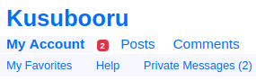

# \<show-unread\>

A web component displaying the number of unread private messages of a user in a
notification badge.



## Development

Install the [Polymer CLI](https://www.npmjs.com/package/polymer-cli).

### Serve locally

```
$ polymer serve
```

### Testing

```
$ polymer test
```
